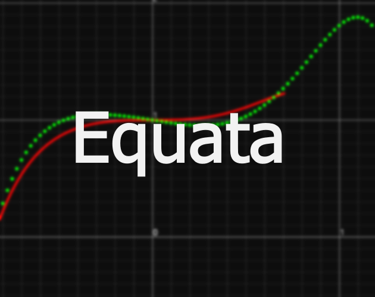

# Equata



Source code for a game made for the [OLC Code Jam 2021](https://itch.io/jam/olc-codejam-2021).


### Game Description
An enemy has launched a missile!
To stop the missile from hitting the town, you need to predict its path.
Use the control panel to make a prediction about the path's FUTURE.
Click 'Confirm' when you are confident of your prediction. But be careful, any mistakes will take away a second of your precious time!
Press 'SPACE' or 'ESCAPE' at any time to pause.

### How to play
You can play the game [here](https://wannesmalfait.itch.io/equata). There is also a download link for a windows executable.
## Build from source
Install `cargo-make`:
```
cargo install cargo-make
```
Then run:
```
cargo make run
```
Or for a release build
```
cargo make --profile release build-native
```
### Web
Run:
```
cargo make serve
```

